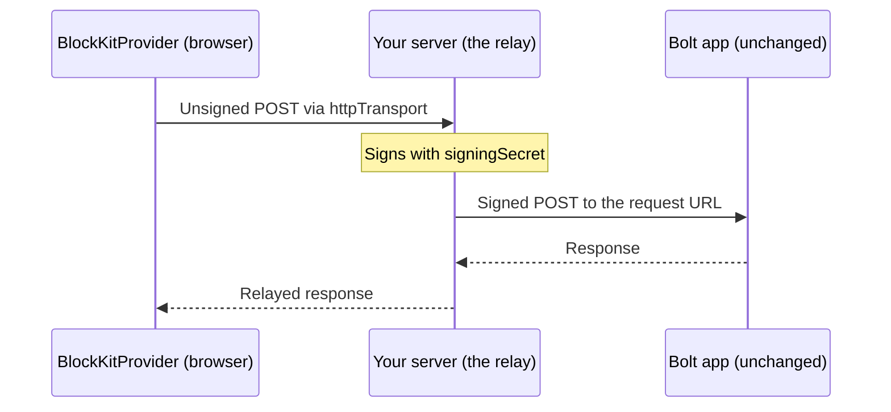

Everything so far handles interactions locally with `onAction`/`onSubmit`/`onOptions`. To instead
drive a real Slack app (the same Bolt or raw HTTP app you'd deploy), point the provider at your
app's request URL. Two pieces make this safe: `httpTransport` on the client, and a relay on your
server that signs the request the way Slack does.



The signing secret never reaches the browser: only your server has it. The browser only ever
talks to its own origin.

## Client: httpTransport

`@nkootstra/block-kit/transport` is browser-safe (no Node built-ins), so it can ship in your page
bundle. `httpTransport` returns `onPayload`/`onSubmit`/`onClose`/`onOptions` ready to spread onto the
provider:

```tsx
import { BlockKitProvider, Message } from "@nkootstra/block-kit";
import { httpTransport } from "@nkootstra/block-kit/transport";

export function App() {
  return (
    <BlockKitProvider
      {...httpTransport({
        url: "/api/slack/relay",
        onResponse: (payload, result) => console.log("delivered", result.status),
        onError: (payload, error) => console.error("failed to deliver", error),
      })}
    >
      <Message
        blocks={[
          {
            type: "actions",
            block_id: "actions",
            elements: [
              {
                type: "button",
                action_id: "approve",
                text: { type: "plain_text", text: "Approve" },
              },
            ],
          },
        ]}
      />
    </BlockKitProvider>
  );
}
```

<TypeTable
  type={{
    url: {
      type: "string",
      required: true,
      description:
        "Where payloads are POSTed: your relay route, or an app with signature verification disabled.",
    },
    headers: {
      type: "HeadersInit",
      description: "Extra headers, e.g. an internal auth token for your own relay route.",
    },
    fetch: {
      type: "typeof fetch",
      description: "Injectable for tests; defaults to the global fetch.",
    },
    onResponse: {
      type: "(payload, result) => void",
      description: "Called with every payload sent and the app's reply.",
    },
    onError: {
      type: "(payload, error) => void",
      description: "Called when delivery fails or the app answers with a non-2xx status.",
    },
  }}
/>

`block_actions` and `view_closed` are sent fire-and-forget. A `view_submission`'s `response_action`
reply is parsed and applied to the modal automatically, and a `block_suggestion`'s reply fills the
external select, the same as if you'd wired up `onSubmit`/`onOptions` by hand.

## Server: createInteractionRelay

`@nkootstra/block-kit/server` runs on your server (it imports `node:crypto`) and exports a plain
`(Request) => Response` handler that signs the payload `httpTransport` sent and forwards it to your
app's real request URL, then relays the app's reply back:

```ts
import { createInteractionRelay } from "@nkootstra/block-kit/server";

export const relay = createInteractionRelay({
  requestUrl: "https://internal.example.com/slack/events",
  signingSecret: process.env.SLACK_SIGNING_SECRET!,
});
```

<TypeTable
  type={{
    requestUrl: {
      type: "string",
      required: true,
      description: "Your app's Slack request URL (an Events API / interactivity endpoint).",
    },
    signingSecret: {
      type: "string",
      required: true,
      description: "The same signing secret your app is configured with.",
    },
    fetch: {
      type: "typeof fetch",
      description: "Injectable for tests; defaults to the global fetch.",
    },
  }}
/>

### Next.js route handler

```ts app/api/slack/relay/route.ts
import { createInteractionRelay } from "@nkootstra/block-kit/server";

export const POST = createInteractionRelay({
  requestUrl: process.env.SLACK_REQUEST_URL!,
  signingSecret: process.env.SLACK_SIGNING_SECRET!,
});
```

Point `httpTransport({ url: "/api/slack/relay" })` at that route and you're done.

### Bun.serve

```ts server.ts
import { createInteractionRelay } from "@nkootstra/block-kit/server";

const relay = createInteractionRelay({
  requestUrl: process.env.SLACK_REQUEST_URL!,
  signingSecret: process.env.SLACK_SIGNING_SECRET!,
});

Bun.serve({
  port: 3000,
  fetch(request) {
    const url = new URL(request.url);
    if (url.pathname === "/api/slack/relay") return relay(request);
    return new Response("Not found", { status: 404 });
  },
});
```

The relay works with any framework that speaks the Fetch API `Request`/`Response` pair: Hono, Vite
middleware, Cloudflare Workers, and so on.

## Why the signing secret must stay server-side

Slack's apps verify every incoming request with an HMAC computed from the signing secret, the request
timestamp and the raw body (`X-Slack-Signature` / `X-Slack-Request-Timestamp`); an unsigned request is
rejected. If the secret shipped in your page's JavaScript, anyone could read it out of the bundle and
forge requests to your app as if they came from Slack. Keeping `signingSecret` only on the server, and
having the browser talk only to your own relay route, over your own origin's auth, is the same trust
boundary a real Slack app relies on.

## Signing without the relay

If you want to send one interaction yourself rather than wiring up the full transport/relay pair
(a background job, a test, a CLI), use the lower-level signing helpers directly, also from
`@nkootstra/block-kit/server`:

```ts
import { sendInteraction, signSlackRequest, postSigned } from "@nkootstra/block-kit/server";
import { buildBlockActionsPayload } from "@nkootstra/block-kit";

const result = await sendInteraction({
  requestUrl: process.env.SLACK_REQUEST_URL!,
  signingSecret: process.env.SLACK_SIGNING_SECRET!,
  payload: buildBlockActionsPayload({
    action: {
      type: "button",
      action_id: "approve",
      block_id: "actions",
      action_ts: "1719000000.000100",
    },
    state: {},
    container: { type: "message", messageTs: "1719000000.000100" },
  }),
});

console.log(result.status, result.responseAction);
```

<TypeTable
  type={{
    signSlackRequest: {
      type: "(signingSecret, timestamp, body) => string",
      description:
        'Slack\'s v0 signing scheme: "v0=" + HMAC-SHA256(secret, `v0:{ts}:{body}`), hex-encoded.',
    },
    postSigned: {
      type: "(opts) => Promise<Response>",
      description: "POSTs an already form-encoded body with the signature headers set, unparsed.",
    },
    sendInteraction: {
      type: "(opts) => Promise<SendInteractionResult>",
      description:
        "postSigned, plus JSON-encoding the payload and parsing the app's response_action reply.",
    },
  }}
/>

## Related

<CardGroup cols={2}>
  <Card title="Handling actions" href="/guides/interactivity" icon="mouse-pointer-click">
    The local onAction/onPayload API this replaces.
  </Card>
  <Card title="Modals" href="/guides/modals" icon="app-window">
    response_action still applies the same way when it comes back through the relay.
  </Card>
  <Card title="External data" href="/guides/external-data" icon="search">
    block_suggestion requests flow through the same transport.
  </Card>
</CardGroup>
